# Dossier d'analyse itération 2
## Diagramme de cas d'utilisation
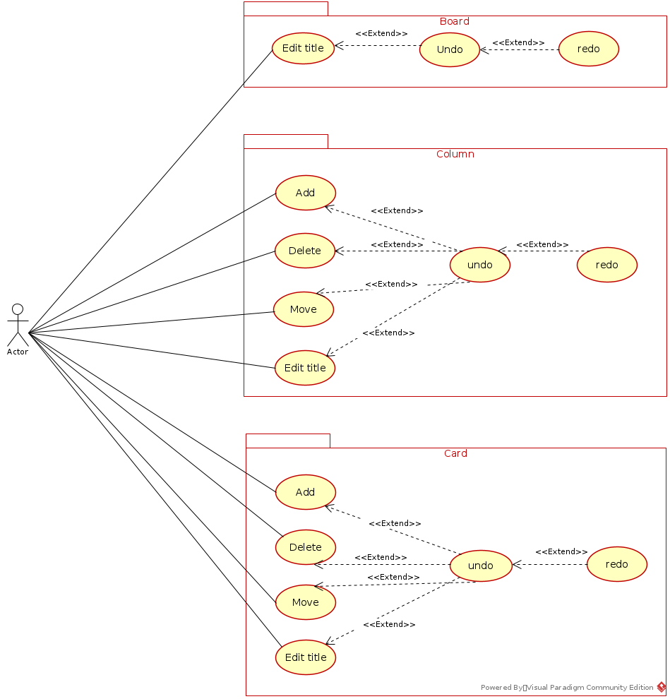

## Diagramme DB
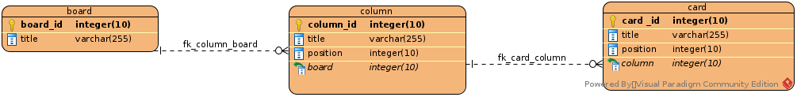

## Diagrammes de classe
### Packages "main" & direction
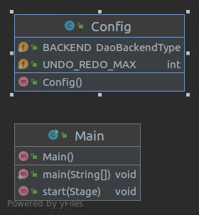

-----

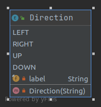

### Package "model"
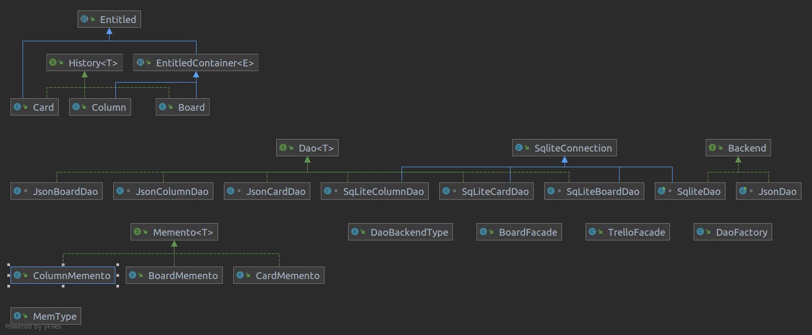

-----

#### Classes du modèle
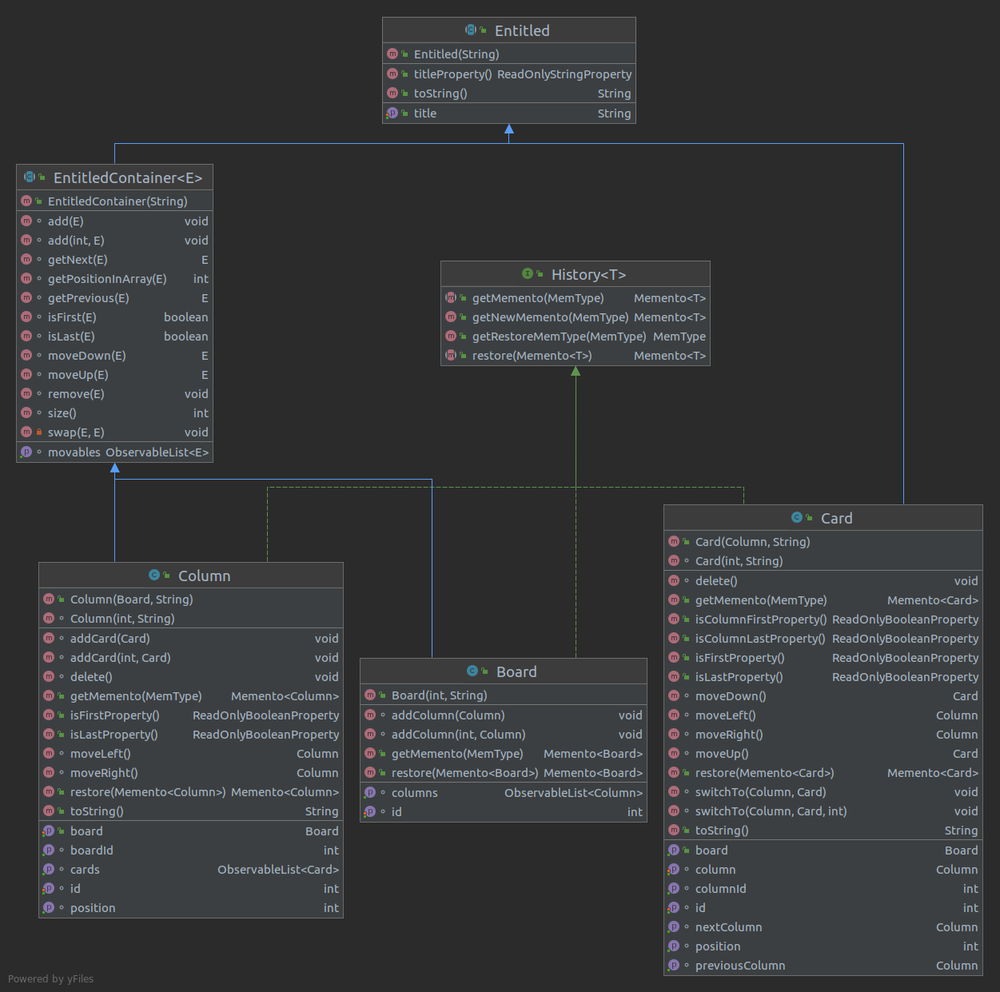

-----

#### Façades
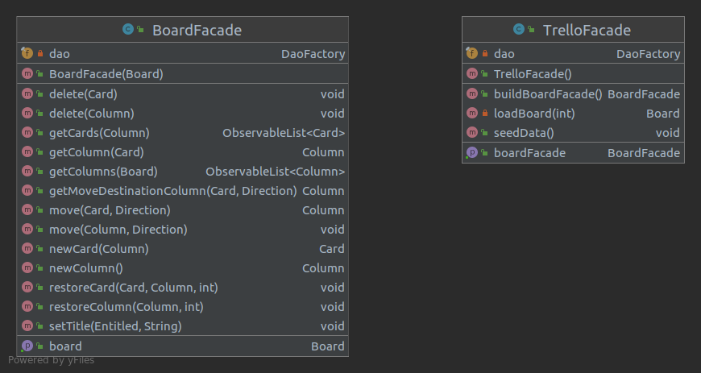

-----

#### Mementos
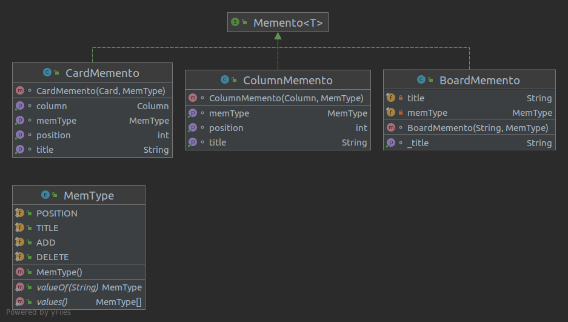

-----

### DAO
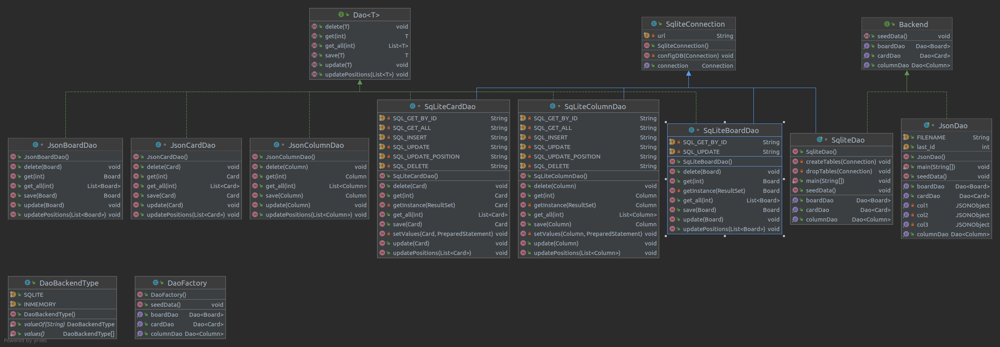

### Package "mvvm"
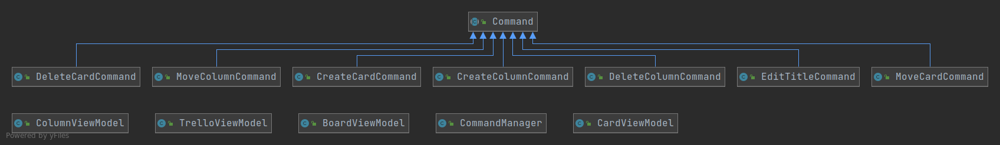

-----

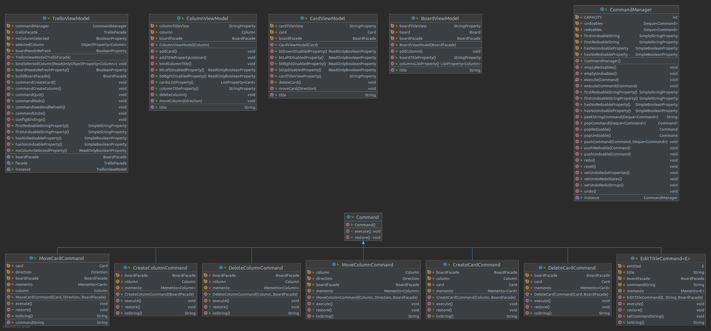

### Package "view"
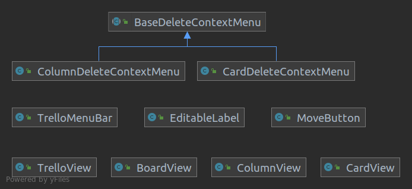

-----

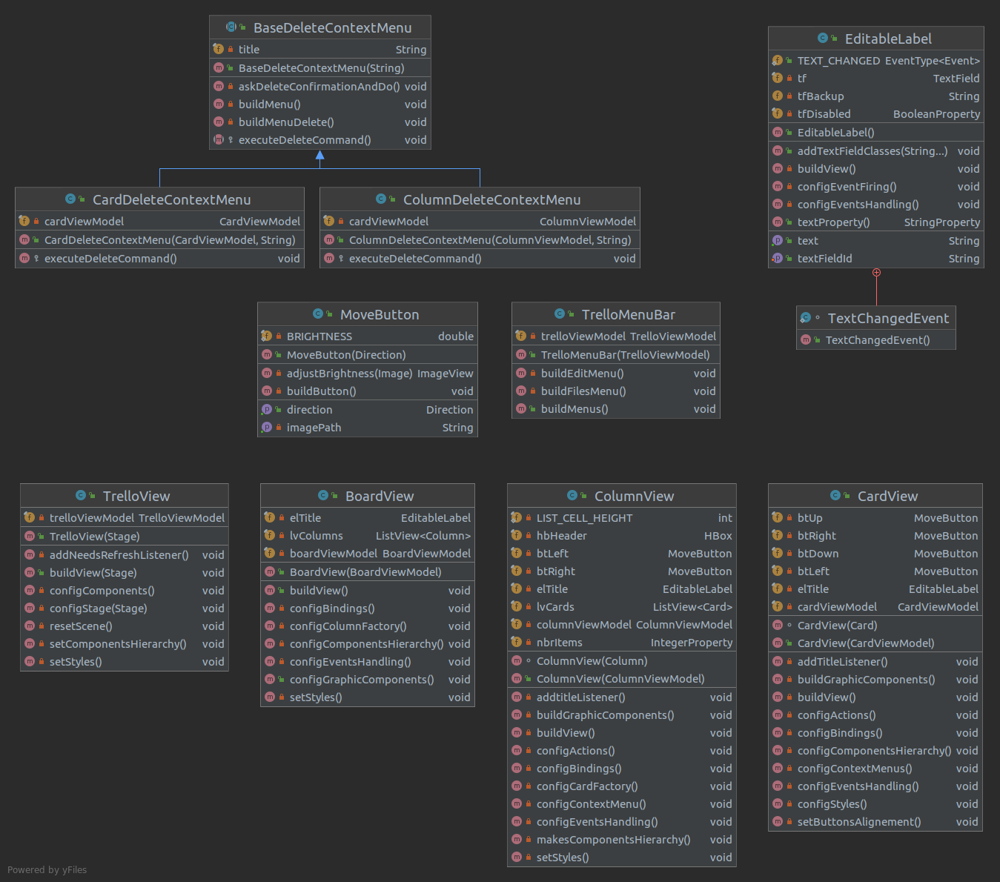

## Diagrammes de séquence
### Déplacement carte vers la droite
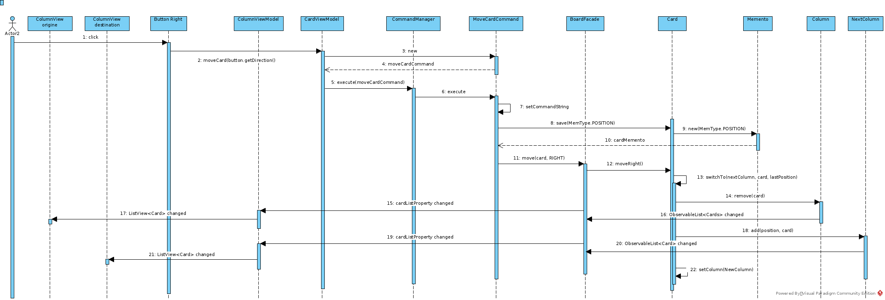

### État disabled/enabled button via bindings
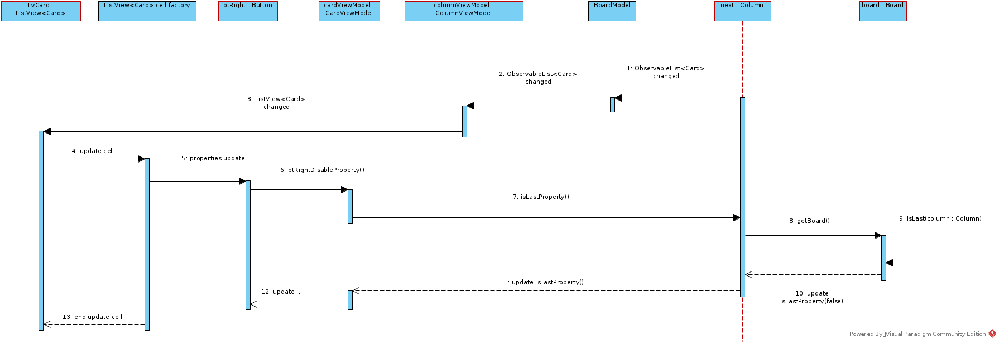

### Annulation déplacement carte
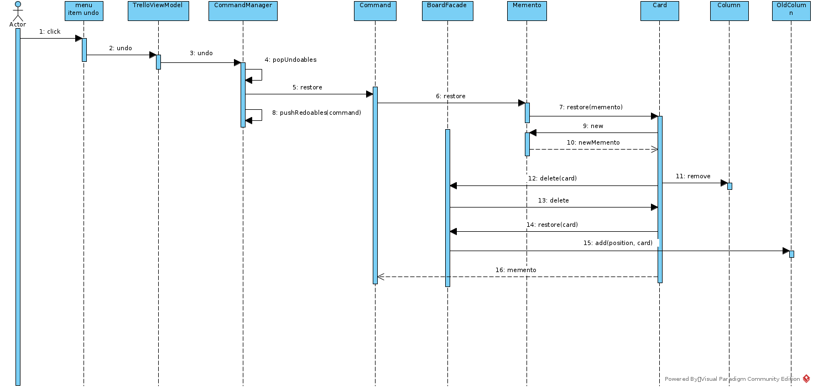

### Suppression colonne (DAO)
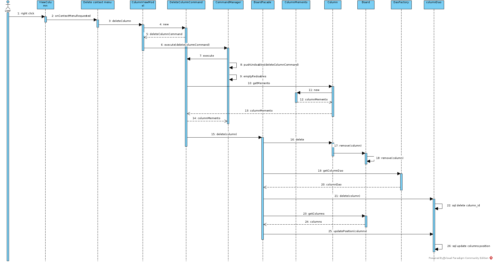
