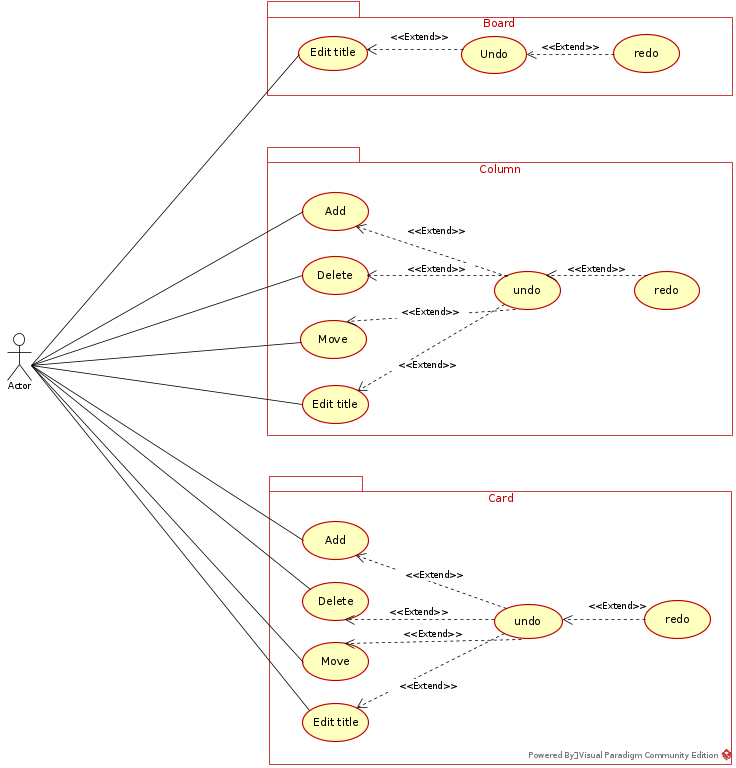
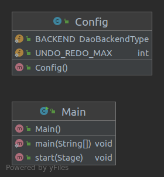
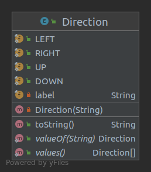
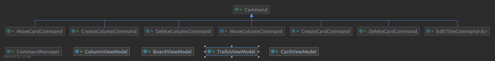
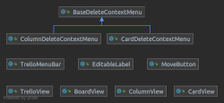

# ANC3 2021 - Dossier d'analyse final
        Etienne Carlier

## Diagramme de cas d'utilisation

-----

## Diagramme DB

-----

## Diagrammes de classe
### Packages "main" & direction

### Package "model"

-----

#### Classes du modèle

#### Façades

#### Mementos

### DAO

-----

### Package "mvvm"

-----

### Package "view"

## Diagrammes de séquence
### Déplacement carte vers la droite

---

### État disabled/enabled button via bindings

### Annulation déplacement carte

---

### Suppression colonne (DAO)

